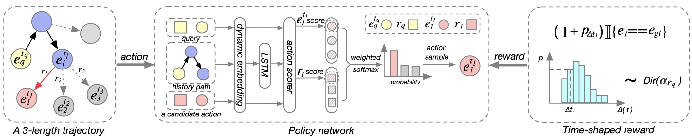

# TITer

This is the data and coded for our EMNLP 2021 paper **TimeTraveler: Reinforcement Learning for Temporal Knowledge Graph Forecasting**



### Qucik Start

#### Data preprocessing

This is not necessary, but can greatly shorten the experiment time.

```
python3 preprocess_data.py --data_dir data/ICEWS14
```

#### Dirichlet parameter estimation

If you use the reward shaping module, you need to do this step.

```
python3 mle_dirichlet.py --data_dir data/ICEWS14 --time_span 24
```

#### Train
you can run as following:
```
python3 main.py --data_path data/ICEWS14 --cuda --do_train --reward_shaping --time_span 24
```

#### Test
you can run as following:
```
python3 main.py --data_path data/ICEWS14 --cuda --do_test --IM --load_model_path xxxxx
```

### Acknowledgments
model/dirichlet.py is from https://github.com/ericsuh/dirichlet

### Cite

```
@inproceedings{Haohai2021TITer,
	title={TimeTraveler: Reinforcement Learning for Temporal Knowledge Graph Forecasting},
	author={Haohai Sun, Jialun Zhong, Yunpu Ma, Zhen Han, Kun He.},
	booktitle={EMNLP},
	year={2021}
}
```
